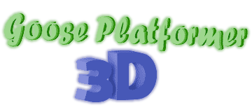
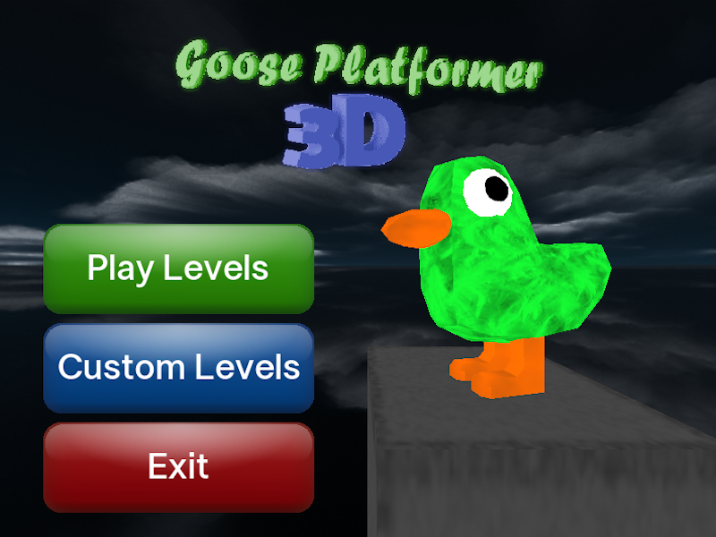
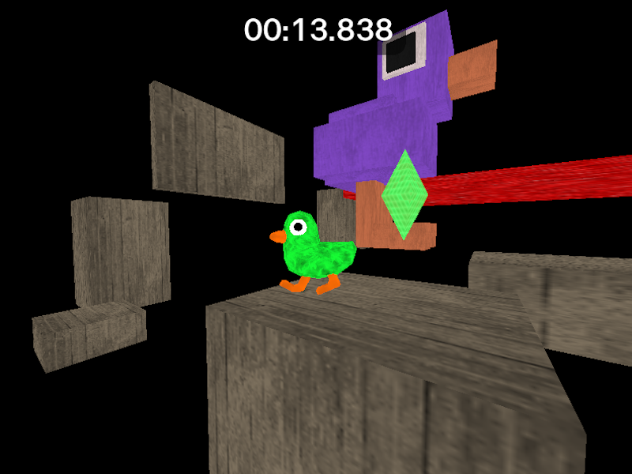
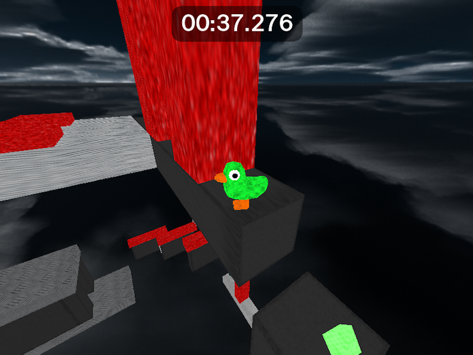
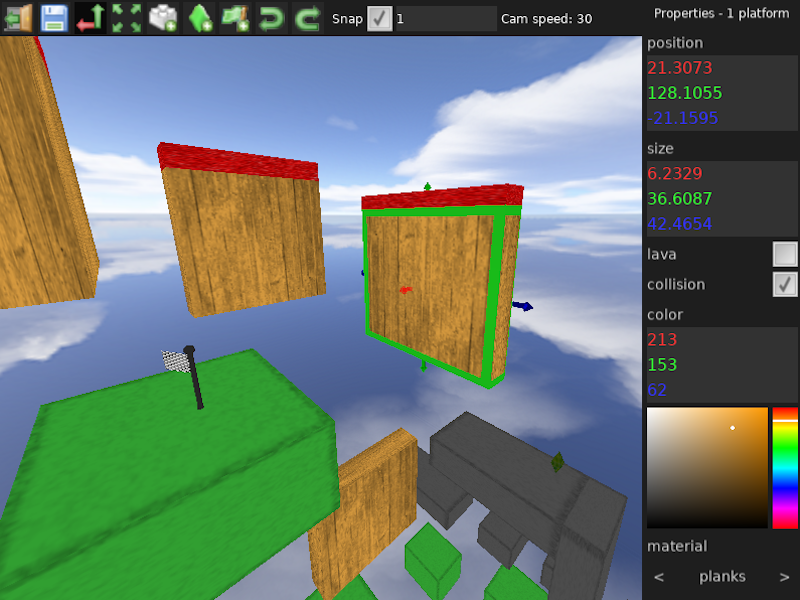

---
**Goose Platformer 3D** is a platformer game / sandbox with a level editor and a goose, made in **Love2D!!!**

Yea... a 3D game, in a 2D engine... which is made possible with the [g3d library](https://github.com/groverburger/g3d) for 3D rendering! Everything else (physics, collision, and all the painful vector math) was done from scratch!

# Features
- A custom and smooth player movement / physics engine built from the ground up
- A custom player animation system
- A buttery-smooth menu allowing you to play and create levels with ease!
- A fully featured level editor, built from scratch, with many, MANY useful features such as:
    - Copy/Paste/Cut/Duplicate
    - Undo/Redo history
    - Snap tool
    - Keybind system
    - Properties window allowing you to set all values for objects
    - Setting colors, materials, and collision on platforms
    - Checkpoint and finish line objects
    - Multi-select
- Three built-in levels, all made with the level editor that YOU can use too!!!

# Installation

Install the zip either from [the itch.io page](https://nibbl-z.itch.io/goose-platformer-3d) or [the releases tab](https://github.com/Nibbl-z/goose-platformer-3d/releases/tag/v1.0), un-zip it, and run the .exe! It's that simple!

Alternatively, you can play the web build on [the itch.io page!](https://nibbl-z.itch.io/goose-platformer-3d)

# Screenshots

